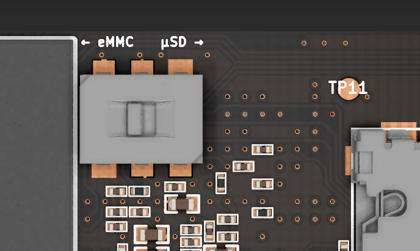

# USB armory Mk II boot modes

The USB armory Mk II supports 3 boot mechanisms:

* internal 16GB eMMC
* external microSD
* USB Serial Download Protocol (SDP)

A slide switch allows selection of tha primary boot mode. The switch positions
match the position of the storage media components:

* left  (towards eMMC):         boot from internal eMMC
* right (towards microSD slot): boot from external microSD



*Tip*: if you have a microSD card you can use one of its edges to change the
switch position.

# Fallback

The boot process falls back to other boot modes, in case the attempted boot
fails not find valid instructions.

* eMMC boot mode:
  1. Try eMMC first
  2. Try microSD second
  3. Fall back to USB SDP mode

* microSD boot mode:
  1. Try microSD first
  2. Fall back to USB SDP mode

# Serial Download Protocol (SDP)

The serial downloader can be found in the [imx usb loader repository](https://github.com/boundarydevices/imx_usb_loader)
and used to directly download and execute code on the SoC.

The ```verify``` and ```debugmode``` flags can also be used as debugging aid to
verify correct SoC operation.

```
imx_usb -v -d u-boot.imx
```
