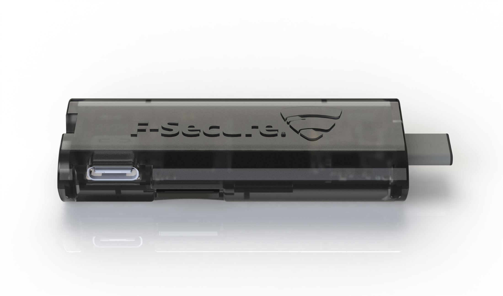
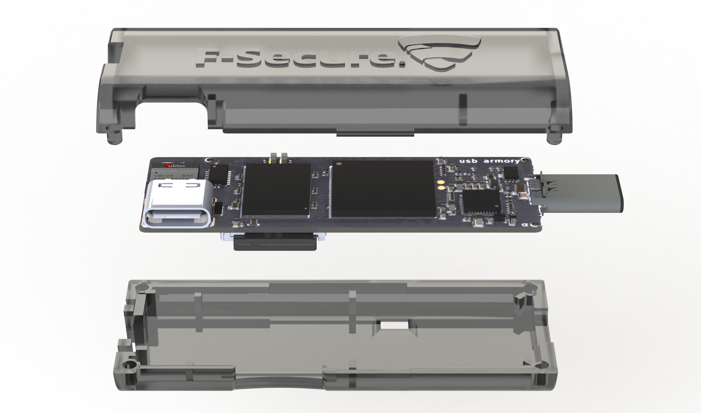

## Official

The USB armory Mk II enclosure is a custom 2 pieces design specifically
designed to accommodate and protect the board.

The enclosure can be easily assembled by snapping the two separate body parts.

Just like the USB armory, the enclosure manufacturing, including its material,
is entirely made in Italy.

Please see ordering information at the [USB armory project page](https://inversepath.com/usbarmory).

* Specifications:
  * Dimensions:
    * body: 60 x 24 x 11 mm
  * Material: NEVIESTER EG83 (PETG)
  * Color: transparent

