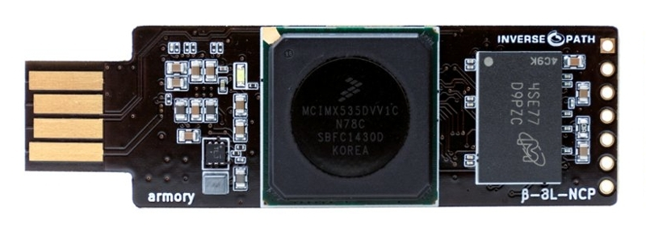
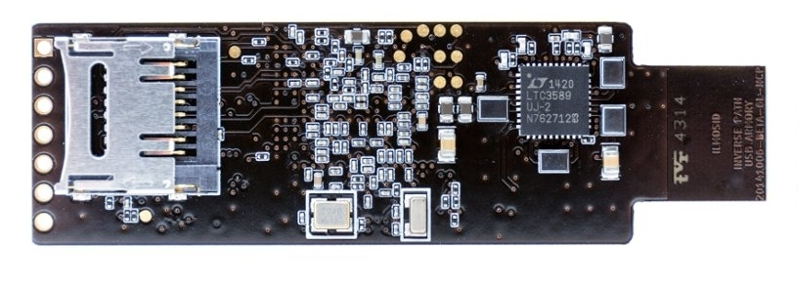

Welcome to the USB armory wiki.

The USB armory from [Inverse Path](https://inversepath.com) is an open source
hardware design, implementing a flash drive sized computer.

For a project introduction and information about purchasing an USB armory board
please see information at the [USB armory project page](https://inversepath.com/usbarmory).

The following page provides useful information on how to get started:

* [**Getting started**](https://github.com/inversepath/usbarmory/wiki/Starting)
* [Preparing a bootable image](https://github.com/inversepath/usbarmory/wiki/Preparing-a-bootable-image)
* [Buildroot profiles](https://github.com/inversepath/usbarmory/tree/master/software/buildroot)
* [Host communication](https://github.com/inversepath/usbarmory/wiki/Host-communication)
* [Applications](https://github.com/inversepath/usbarmory/wiki/Applications)
* [Frequently Asked Questions (FAQ)](https://github.com/inversepath/usbarmory/wiki/Frequently-Asked-Questions-(FAQ))
* Application repositories
  * [INTERLOCK file encryption front-end, with Signal messaging support](https://github.com/inversepath/interlock)
  * [Crucible OTP fusing tool](https://github.com/inversepath/crucible)
* Operating Systems
  * [Precompiled images](https://github.com/inversepath/usbarmory/wiki/Available-images)
  * [Debian image preparation](https://github.com/inversepath/usbarmory/wiki/Preparing-a-bootable-image)
  * Embedded INTERLOCK distribution: [Mk II](https://github.com/inversepath/usbarmory/tree/master/software/buildroot/README-INTERLOCK-mark-two.md), [Mk I](https://github.com/inversepath/usbarmory/tree/master/software/buildroot/README-INTERLOCK.md)
  * Arch Linux ARM: [Mk II](https://archlinuxarm.org/platforms/armv7/freescale/usb-armory-mk-ii), [Mk I](http://archlinuxarm.org/platforms/armv7/freescale/usb-armory)
  * [Kali Linux](https://docs.kali.org/kali-on-arm/kali-linux-on-usb-armory)
  * [Genode OS](https://github.com/inversepath/usbarmory/wiki/Genode-OS)
* [External resources](https://github.com/inversepath/usbarmory/wiki/External-resources)

The following sections provide information specific to each USB armory model.

# USB armory Mk II

 

* Specifications
  * SoC: NXP i.MX6UL/i.MX6ULZ ARM® Cortex™-A7 900Mhz
  * RAM: 512MB/1GB DDR3
  * Storage: internal 16GB eMMC + external microSD
  * Bluetooth module: u-blox ANNA-B112 BLE
  * USB Type-C ports: OTG receptacle + UFP plug
  * Secure elements: Microchip ATECC608A + NXP A71CH
* [Roadmap](https://github.com/inversepath/usbarmory/wiki/Mk-II-Roadmap)
* [Security features](https://github.com/inversepath/usbarmory/wiki/Hardware-security-features-(Mk-II))
* [Secure boot](https://github.com/inversepath/usbarmory/wiki/Secure-boot-(Mk-II))
* [Benchmarks](https://github.com/inversepath/usbarmory/wiki/Benchmarks-(Mk-II))
* [Internal Boot ROM](https://github.com/inversepath/usbarmory/wiki/Internal-Boot-ROM-(Mk-II))
* [Debug accessory](https://github.com/inversepath/usbarmory/tree/master/hardware/mark-two-debug-accessory)
* [Boot modes](https://github.com/inversepath/usbarmory/wiki/Boot-Modes-(Mk-II))
* [Bluetooth](https://github.com/inversepath/usbarmory/wiki/Bluetooth)
* [I²C](https://github.com/inversepath/usbarmory/wiki/I²C-(Mk-II))
* Cryptography co-processor drivers: [DCP](https://github.com/inversepath/mxs-dcp) (i.MX6ULZ), [CAAM](https://github.com/inversepath/caam-keyblob) (i.MX6UL)

# USB armory Mk I

 

* Specifications
  * SoC: NXP i.MX53 ARM® Cortex™-A8 800Mhz
  * RAM: 512MB DDR3
  * Storage: external microSD
  * USB Type-A: OTG plug
* [Security features](https://github.com/inversepath/usbarmory/wiki/Hardware-security-features-(Mk-I))
* [Secure boot](https://github.com/inversepath/usbarmory/wiki/Secure-boot-(Mk-I))
* [Secure boot (with NXP tools)](https://github.com/inversepath/usbarmory/wiki/Secure-boot-with-NXP-tools-(Mk-I))
* [Host adapter](https://github.com/inversepath/usbarmory/wiki/Host-adapter)
* [Device communication (stand-alone mode)](https://github.com/inversepath/usbarmory/wiki/Host-adapter)
* [Benchmarks](https://github.com/inversepath/usbarmory/wiki/Benchmarks)
* [Power consumption](https://github.com/inversepath/usbarmory/wiki/Power-consumption)
* [X-ray](https://github.com/inversepath/usbarmory/wiki/X-ray)
* [Internal Boot ROM](https://github.com/inversepath/usbarmory/wiki/Internal-Boot-ROM-(Mk-I))
* [Enclosures](https://github.com/inversepath/usbarmory/wiki/Enclosures)
* [JTAG](https://github.com/inversepath/usbarmory/wiki/JTAG)
* Using the breakout header: [Serial, GPIOs](https://github.com/inversepath/usbarmory/wiki/GPIOs), [I²C](https://github.com/inversepath/usbarmory/wiki/I²C), [SPI](https://github.com/inversepath/usbarmory/wiki/SPI)
* Cryptography co-processor driver: [SCCv2](https://github.com/inversepath/mxc-scc2) (i.MX53)

*Note*: the USB armory Mk I reached End-of-life (EOL) and is no longer available.

## How to Contribute

Obtain a USB armory board and start developing! Please see ordering information
at the [USB armory project page](https://inversepath.com/usbarmory).

A list of project ideas is available at the [project page](https://inversepath.com/usbarmory) or
in the [Applications](https://github.com/inversepath/usbarmory/wiki/Applications) section.

A discussion group is available on [Google Groups](https://groups.google.com/d/forum/usbarmory).

## Support

If you think anything is missing on this wiki, or require further support,
please email us at support@inversepath.com.

## License

USB armory | https://inversepath.com/usbarmory  
Copyright (c) F-Secure Corporation

This is an open hardware design licensed under the terms of the CERN Open
Hardware Licence (OHL) v1.2.

You may redistribute and modify this documentation under the terms of the CERN
OHL v.1.2 (http://ohwr.org/cernohl). This documentation is distributed WITHOUT
ANY EXPRESS OR IMPLIED WARRANTY, INCLUDING OF MERCHANTABILITY, SATISFACTORY
QUALITY AND FITNESS FOR A PARTICULAR PURPOSE. Please see the CERN OHL v.1.2 for
applicable conditions.

## Terms of Use

The following Terms of Use apply to USB armory boards manufactured by Inverse
Path and/or F-Secure and sold directly or through one of its resellers.

IMPORTANT – BEFORE INSTALLING OR USING THE USB ARMORY BOARDS MANUFACTURED BY
INVERSE PATH AND/OR F-SECURE, CAREFULLY READ THE BELOW TERMS OF USE (”TERMS”).
BY OPTING TO ACCEPT, BY INSTALLING OR USING THE USB ARMORY YOU (EITHER AN
INDIVIDUAL OR AN ENTITY) WARRANT THAT YOU HAVE READ THESE TERMS, UNDERSTAND
THEM AND AGREE TO BE LEGALLY BOUND BY THEM. IF YOU DO NOT AGREE TO ALL OF THE
TERMS, DO NOT INSTALL OR USE THE USB ARMORY.

* [Terms of Use](https://github.com/inversepath/usbarmory/wiki/Terms-of-Use)
