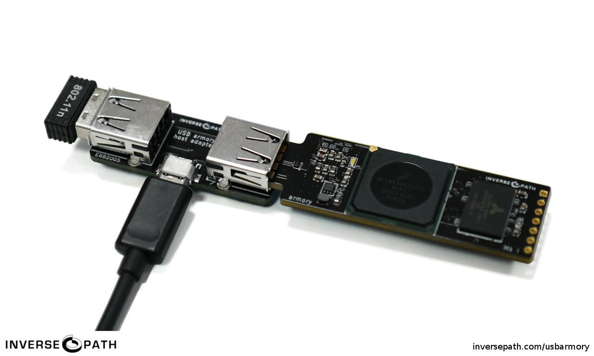
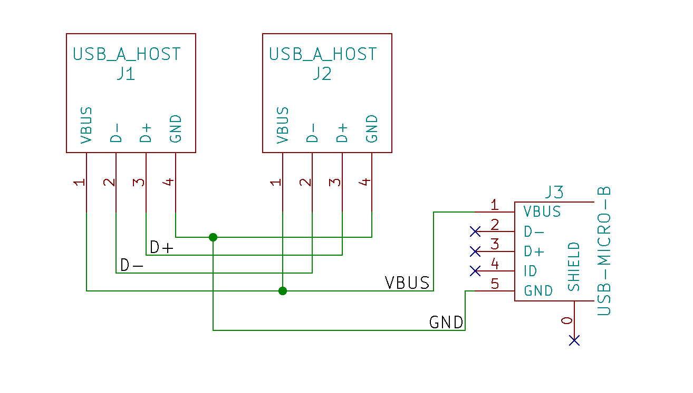

## Scope

This page applies to the USB armory Mk I only.

The USB armory Mk II features a USB receptacle which can be natively used for USB host functionality without requiring adapters or re-configuration (see this [FAQ entry](https://github.com/usbarmory/usbarmory/wiki/Frequently-Asked-Questions-(FAQ)#how-do-i-set-the-usb-type-c-receptacle-in-device-mode-mk-ii)).

### Enabling host mode

The USB armory is primarily meant to be attached to a USB host, such as a
laptop or desktop computer. However, it can be also used as a standalone
computer by using a custom host adapter.

The host adapter leverages the fact that it is possible, by changing the Linux
kernel device tree configuration, to invert the role of the USB On-The-Go port
currently used as main plug for the board. This allows the USB armory to be used
independently as a host.

The role change can be enabled by using a device tree source file (dts) with the following configuration:

```
&usbotg {
        dr_mode = "host";
        status = "okay";
};
```

The official USB armory repository provides an example [here](https://github.com/usbarmory/usbarmory/blob/master/software/kernel_conf/mark-one/imx53-usbarmory-host.dts).

The device tree binary file can then be compiled as shown in the [microSD image preparation instructions](https://github.com/usbarmory/usbarmory/wiki/Preparing-a-bootable-image), taking in account the different dts file.

The resulting dtb can be copied to /boot/imx53-usbarmory.dtb on the USB armory when host mode functionality is desired (it is recommended to keep the standard device dtb file around to switch it over when desired).

### Hardware adapter

In order to use host mode an adapter is needed to perform the following functions:

 * Bridging the USB armory male plug to a USB Type A receptacle (gender changer).
 * Accepting power from a micro-USB input.

This simple conversion enables connection between the USB armory, power supply,
and a USB device or hub. Therefore, it is only a matter of compiling the right
Linux kernel modules and the USB armory can independently use a keyboard, USB
display, USB mass storage devices, USB WiFi dongle and more.

Connecting a powered USB hub to the adapter ensures that all the connected USB
devices have enough power to perform their tasks. Additionally, a micro-USB
cable we can power the USB armory itself. Alternatively, a passive USB hub can
be used and a micro-USB charger (such as ones used for most mobile phones) can
provide power.

The host adapter can be easily built using a breadboard as follows (only
recommended for people with experience in DIY hardware and electronics):

  * D+, D- bridged from a Type A receptacle to the other
  * VBUS, GND shorted between the two Type A receptacles and a micro-USB one

**Fun fact**: the host adapter can also be used to prevent accidental data exchange enabling secure charging.



