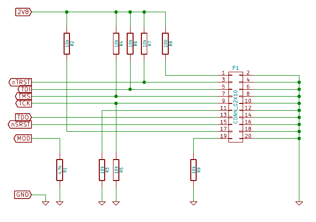

The USB armory exposes the i.MX53 JTAG interface using 7 test
pads and the ground pin on the pin header.
Refer to the following picture to locate the relevant pads.

The following [schematic] (https://github.com/inversepath/usbarmory/raw/master/hardware/jtag-breakout/jtag-breakout.pdf) shows how to connect the pads to a
standard ARM JTAG 20 pin connector.

