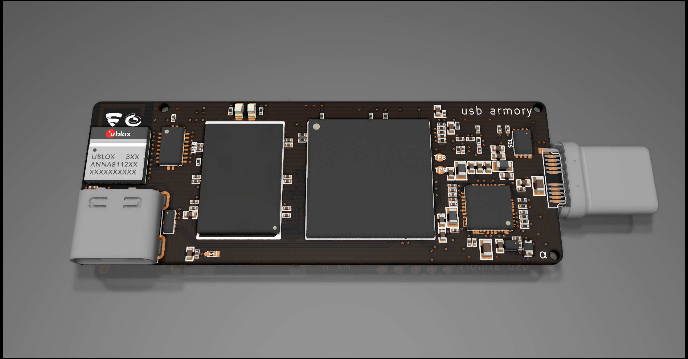
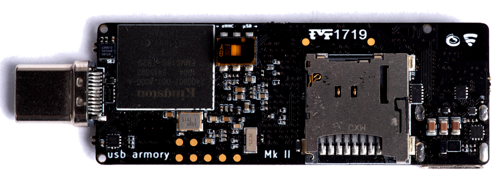
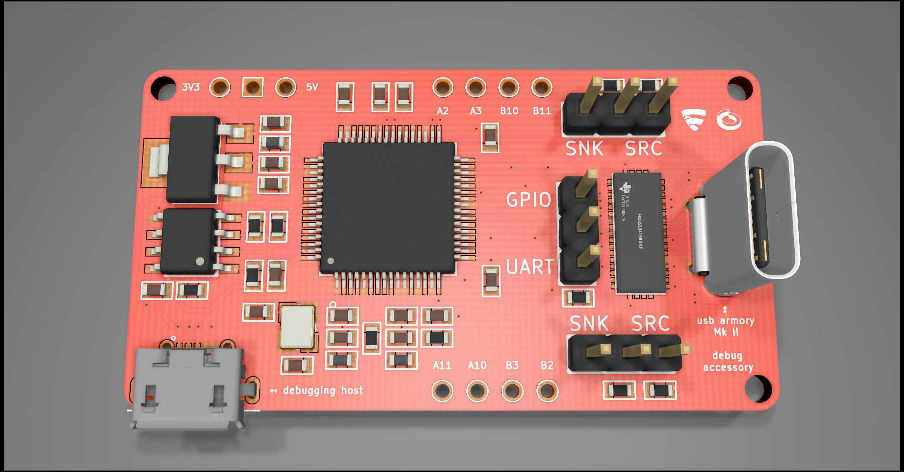

The USB armory from [F-Secure Foundry](https://foundry.f-secure.com) is an open
source hardware design, implementing a flash drive sized computer.

The USB armory Mk II is the successor of the previous [Mk I](https://github.com/usbarmory/usbarmory/wiki#usb-armory-mk-i) model.

## Purchasing

See [Ordering information](https://github.com/usbarmory/usbarmory/wiki/Ordering-information)
for USB armory Mk II variants, accessories and purchase options.

The USB armory Mk II can be purchased at the following resellers:
  * [Mouser](https://eu.mouser.com/new/f-secure/crowd-supply-usb-armorymkii)
  * [Crowd Supply](https://www.crowdsupply.com/f-secure/usb-armory-mk-ii)
  * [Hackerwarehouse](https://hackerwarehouse.com/product/usb-armory-mkii)
  * [HackmoD](http://www.hackmod.de/USB-Armory-Stick-Mark-2)
  * [SparkFun](https://www.sparkfun.com/products/16367)

Custom/bulk order inquiries can be placed directly by contacting
usbarmory@f-secure.com.

## System-on-Chip

The USB armory Mk II default System-on-Chip (SoC) is the NXP i.MX6ULZ, P/N MCIMX6Z0DVM09AB (900 MHz).

An SoC variant using the pin-to-pin compatible i.MX6UL, P/N MCIMX6G3DVM05AB (528
MHz) is available, for custom orders, to provide additional security features such as OTF DRAM
encryption ([features comparison](https://github.com/usbarmory/usbarmory/wiki/Hardware-security-features-(Mk-II))),
with the trade-off of a slower clock rate.

## Security features

See a detailed description [here](https://github.com/usbarmory/usbarmory/wiki/Hardware-security-features-(Mk-II)).

## Communication interfaces

### USB

The USB armory Mk II features Type-C USB ports, a Type-A variant is available
for custom/bulk orders.

Using Type-C USB allows the Mk II to have a plug for traditional USB based
[host communication](https://github.com/usbarmory/usbarmory/wiki/Host-communication)
along with an integrated receptacle to act as a host (or device) (without requiring a
[host adapter](https://github.com/usbarmory/usbarmory/wiki/Host-adapter) like the Mk I used to).

The USB Type-C current mode allows to ensure that adequate current is
requested on the plug side, to enable connection of additional devices on the
socket side.

This design enables new use cases for the USB armory Mk II, which
can act as a USB firewall without the need of additional hardware as well as being
natively expanded with USB peripherals (e.g. drive, network adapters).

Additionally the integrated receptacle also allows its role to be changed to
device, easing scenarios such as controlled USB fuzzing from one side and
interactive console/control on the other.

### Bluetooth

The Mk II includes a [u-blox ANNA-B112](https://www.u-blox.com/en/product/anna-b112-module)
Bluetooth module for out-of-band (in relation to USB interfaces) interaction
with a wireless client (e.g. mobile application).

The addition of a Bluetooth module opens up a variety of new use cases for the
USB armory Mk II, greatly enhancing its security applications in terms of
authentication, isolation and limiting trust towards the host.

The ANNA-B112 module supports an "OpenCPU" option to allow arbitrary firmware,
replacing the built-in u-blox one, on its Nordic Semiconductor nRF52832 SoC.
This allows provisioning of the SoC with Nordic SDK, Wirepas mesh, ARM Mbed or
arbitrary user firmware. The nRF52832 SoC features an ARM Cortex-M4 CPU with
512 kB of internal Flash and 64 kB of RAM.

See additional information [here](https://github.com/usbarmory/usbarmory/wiki/Bluetooth).

## Storage media

Apart from the traditional microSD slot (now with a push/pull mechanism) the
USB armory Mk II includes a 16 GB eMMC flash memory on the board.

This allows easier provisioning procedures, factory pre-imaging without the
burden of microSD card installation and enables additional security features.

Additionally a slide switch allows selection of the boot mode (microSD vs
eMMC), supporting easy selection of boot media for dual boot purposes (e.g.
full Linux OS vs [INTERLOCK](https://github.com/usbarmory/interlock)
protected image).

## Software

* A wide variety of Linux distributions is [available](https://github.com/usbarmory/usbarmory/wiki/Available-images), the main one supported by F-Secure is a [Debian image](https://github.com/usbarmory/usbarmory-debian-base_image).

* The [TamaGo](https://github.com/usbarmory/tamago) bare metal Go compiler
includes [imx6 drivers](https://github.com/usbarmory/tamago/tree/master/soc/imx6)
and [Mk II board support](https://github.com/usbarmory/tamago/tree/master/board/f-secure/usbarmory).

* A Linux kernel driver for the DCP (i.MX6ULZ), which takes advantage of the
OTPMK released by the SNVS, is available at
[https://github.com/usbarmory/mxs-dcp](https://github.com/usbarmory/mxs-dcp).

* A Linux kernel driver for the CAAM (i.MX6UL), which takes advantage of the
OTPMK released by the SNVS, is available at
[https://github.com/usbarmory/caam-keyblob](https://github.com/usbarmory/caam-keyblob).

* The [INTERLOCK](https://github.com/usbarmory/interlock) file encryption
front-end supports both CAAM and DCP through such drivers.

* The [crucible](https://github.com/usbarmory/crucible/tree/master/cmd/crucible)
utility provides user space support for reading, and writing, One-Time-Programmable (OTP) fuses.

* The [habtool](https://github.com/usbarmory/crucible/tree/master/cmd/habtool)
utility provides support for Secure Boot provisioning and executable signing.

* The [armoryctl](https://github.com/usbarmory/armoryctl) tool provides user
space support for communicating with the Mk II internal peripherals.

* The [TamaGo](https://github.com/usbarmory/tamago) framework has been used to create
the following USB armory Mk II applications:
  * [GoKey](https://github.com/usbarmory/GoKey) - OpenPGP/U2F smartcard.
  * [GoTEE](https://github.com/usbarmory/GoTEE) - Trusted Execution Environment w/ TrustZone.
  * [armory-drive](https://github.com/usbarmory/armory-drive) - USB encrypted drive.
  * [armory-boot](https://github.com/usbarmory/armory-boot) - secure primary boot loader.

## Accessory mode

USB Type-C allows a 'debug accessory mode' to route analog/debug signals over
its connector, the USB armory Mk II leverages on this to break out UART, SPI,
I²C, GPIOs.

A dedicated [debug accessory board](https://github.com/usbarmory/usbarmory/tree/master/hardware/mark-two-debug-accessory)
allows access to UART and GPIO signals through USB, without requiring probes,
through an FTDI FT4232H. This allows, for example, accessing the USB armory Mk
II serial console without wires or probes, natively using only USB cables.

